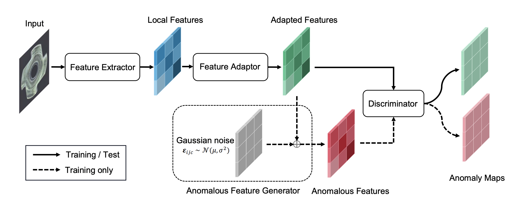

# SimpleNet




**SimpleNet: A Simple Network for Image Anomaly Detection and Localization**

*Zhikang Liu, Yiming Zhou, Yuansheng Xu, Zilei Wang1**

Paper: [arxiv 2303.15140](https://arxiv.org/pdf/2303.15140.pdf)

##  Introduction

This repo contains source code for **SimpleNet** implemented with pytorch.

SimpleNet is a simple defect detection and localization network that built with a feature encoder, feature generator and defect discriminator. It is designed conceptionally simple without complex network deisng, training schemes or external data source.

## Get Started 

### Environment 

**Python3.8**

**Packages**:
- torch==1.12.1
- torchvision==0.13.1
- numpy==1.22.4
- opencv-python==4.5.1

(Above environment setups are not the minimum requiremetns, other versions might work too.)


### Data

Edit `run.sh` to edit dataset class and dataset path.

#### MvTecAD

Download the dataset from [here](https://www.mvtec.com/company/research/datasets/mvtec-ad/).

The dataset folders/files follow its original structure.

### Run

#### Demo train

Please specicy dataset path (line1) and log folder (line10) in `run.sh` before running.

`run.sh` gives the configuration to train models on MVTecAD dataset.
```
bash run.sh
```

## Citation
```
@misc{liu2023simplenet,
      title={SimpleNet: A Simple Network for Image Anomaly Detection and Localization}, 
      author={Zhikang Liu and Yiming Zhou and Yuansheng Xu and Zilei Wang},
      year={2023},
      eprint={2303.15140},
      archivePrefix={arXiv},
      primaryClass={cs.CV}
}
```

## License

All code within the repo is under [MIT license](https://mit-license.org/)